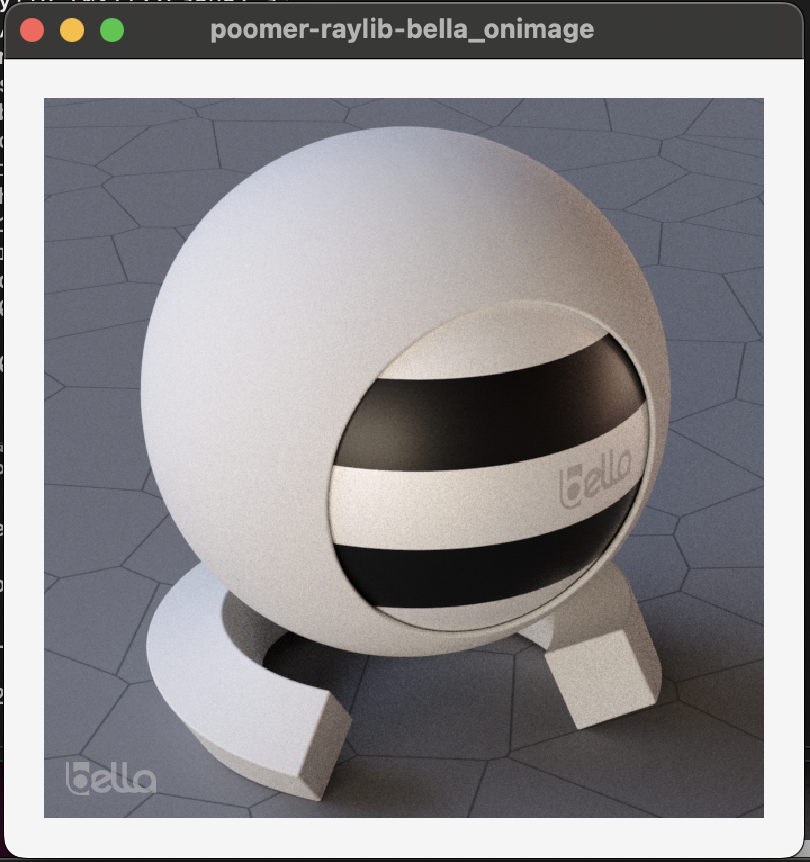
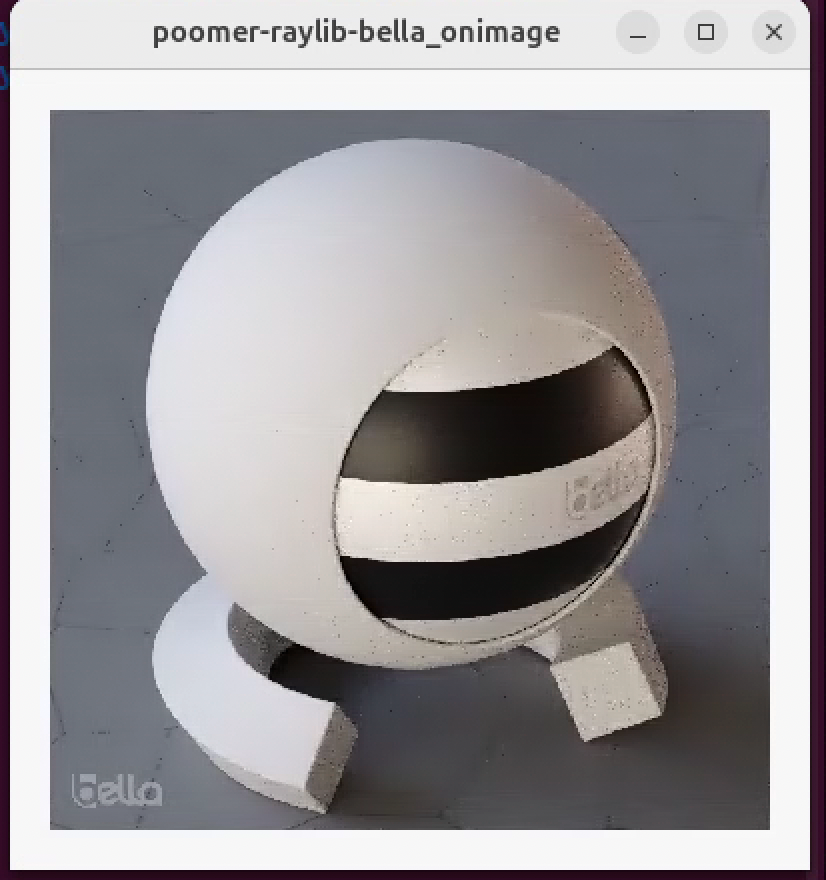
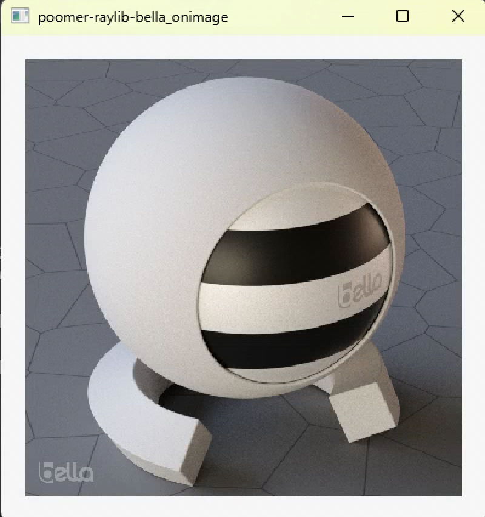

# poomer-raylib-bella_onimage

c++ prototype GUI interface for [Bella Path Tracer](https://bellarender.com) using raylib/raygui with command line build instructions for MacOS/Win/Linux





# Build

```
workdir/
├── bella_engine_sdk/
├── raylib/
├── raygui/
└── poomer-raylib-bella_onimage/
```

Download SDK for your OS and drag bella_engine_sdk into your workdir. On Windows rename unzipped folder by removing version ie bella_engine_sdk-24.6.0 -> bella_engine_sdk

- [bella_engine_sdk MacOS](https://downloads.bellarender.com/bella_engine_sdk-24.6.0.dmg)
- [bella_engine_sdk Linux](https://downloads.bellarender.com/bella_engine_sdk-24.6.0.tar.gz)
- [bella_engine_sdk Win](https://downloads.bellarender.com/bella_engine_sdk-24.6.0.zip)


# MacOS/Linux

Linux dependencies
```
apt install libx11-dev
apt install xorg-dev
```

cmake -DBUILD_SHARED_LIBS=OFF -DUSE_EXTERNAL_GLFW=OFF ..

```
cd workdir
git clone https://github.com/raysan5/raylib.git
mkdir -p raylib/build
cd raylib/build
/Applications/CMake.app/Contents/bin/cmake -DBUILD_SHARED_LIBS=ON -DCMAKE_BUILD_TYPE=Release ..
make -j4
cd ../..
git clone https://github.com/raysan5/raygui.git
git clone https://github.com/oomer/poomer-raylib-bella_onimage.git
cd poomer-raylib-bella_onimage
make
```

# Windows
- Install Visual Studio Community 2022 
- Add Desktop development with C++ workload
- Launch x64 Native tools Command Prompt for VS2022
```
cd workdir
git clone https://github.com/raysan5/raylib.git
cd raylib
mkdir build
cd build
cmake ..
msbuild raylib.sln /p:Configuration=Release 
cd ../..
git clone https://github.com/raysan5/raygui.git
git clone https://github.com/oomer/poomer-raylib-bella_onimage.git
msbuild poomer-raylib-bella_onimage.vcxproj /p:Configuration=release /p:Platform=x64 /p:PlatformToolset=v143
```
